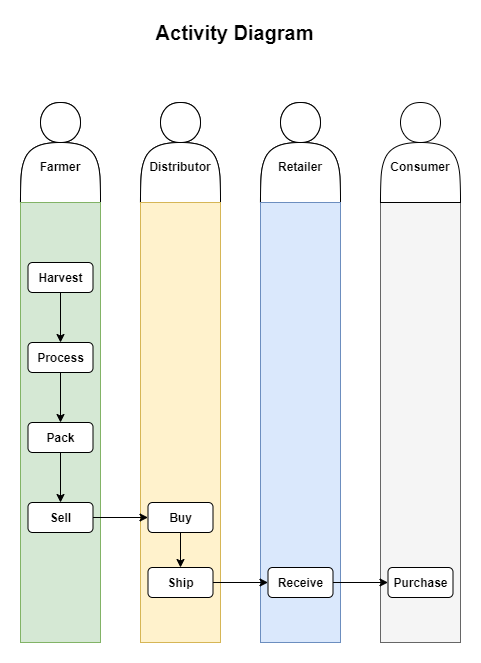
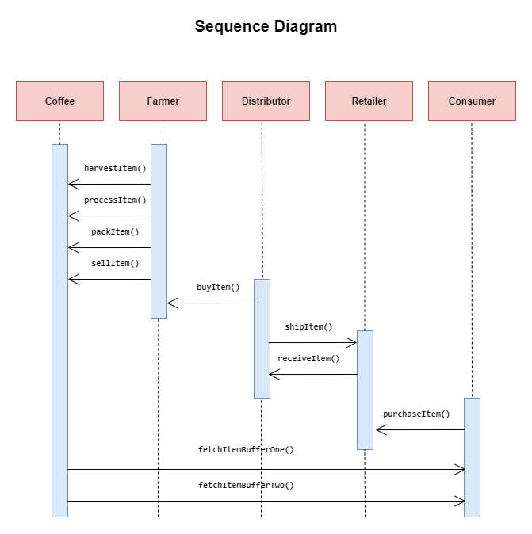
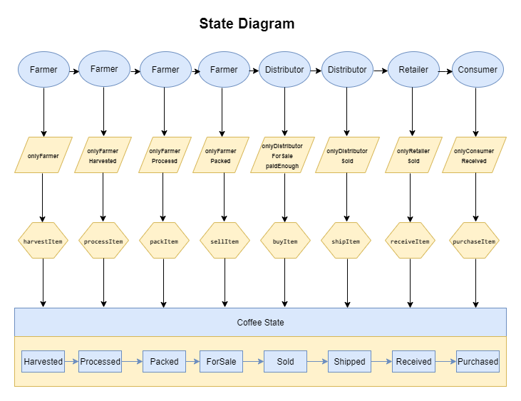
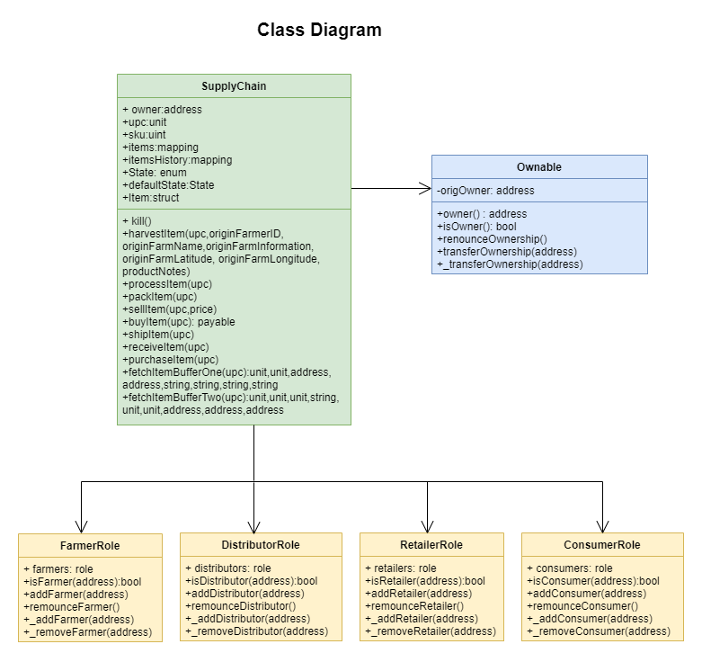
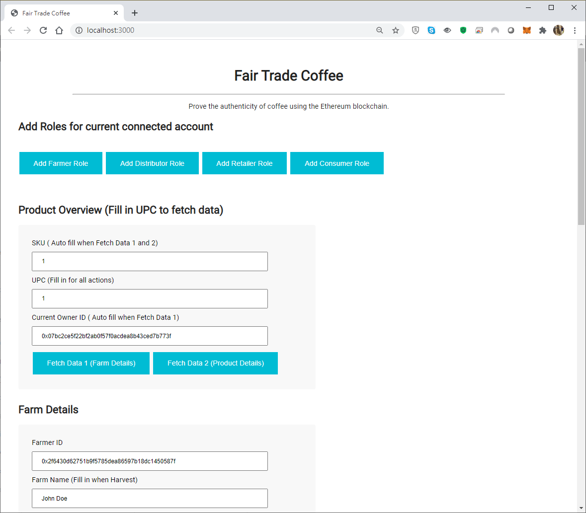
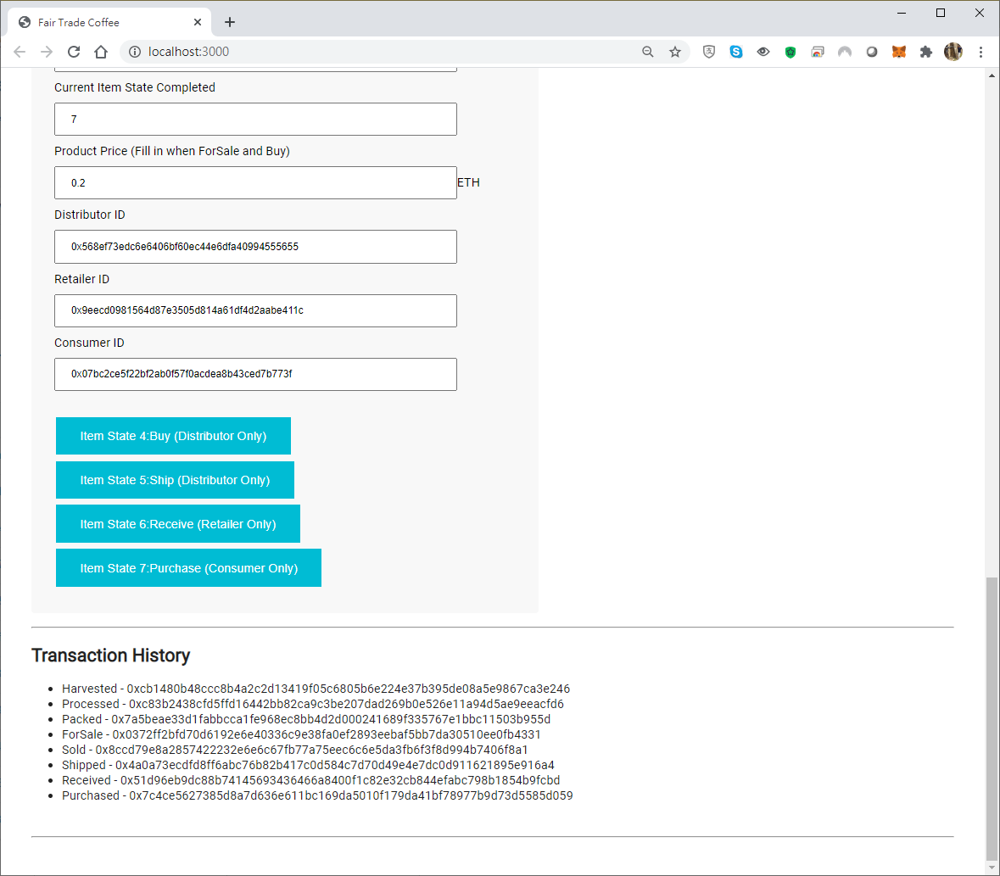

# Ethereum Dapp for Tracking Items through Supply Chain

In this project, a DApp supply chain solution backed by the Ethereum platform was created. Smart contracts were architected to manage specific user permission controls as well as contracts that track and verify a product’s authenticity.

## UML

### Activity



### Sequence



### State



### Class



## Libraries

The ```Roles``` library was used by access control contracts for easy add and remove in the supply chain
```truffle-hd-wallet-provider``` was used to sign transactions for addresses.

## IPFS

IPFS was not used in the project

## Package Information

1. Node version: v12.18.2
2. Truffle version: v4.1.14
3. Solidity version: v0.4.24
4. Web3 version: 1.2.1
5. truffle-hdwallet-provider version:1.0.17

## Smart contracts deployed to Ethereum RINKEBY test network

Migrations.sol: address ```0x7ba81b163d98844aa1aaea74b4d45a7ed01c24dc``` transaction id ```0xec4b752b78ea764bf55da663fbf23b7e945e36037a05a05efdfc911e4e005930```

FarmerRole.sol: address ```0x5ae3fb297f001ac0683a6fc8dc7a334822952c07``` transaction id ```0x59f99a8e897b1e8ec56147eadfa0afcfd833343d12c4bc22516723e1b521b5ca```

DistributorRole.sol: address ```0xf65b89afbeba7b820e48702bacddc31a626cf148``` transaction id ```0x30a12661e00232997a71598796e9922bcd425d6bf3b60f69573494fc6bba3b5a```

RetailerRole.sol: address ```0x93acb6d66c89de075e787bf612bace196ba05dde``` transaction id ```0x666920f775b93249e8984b1e68cc301e5de978cd2ea27ebe86cadcf479d7d0ef```

ConsumerRole.sol: address ```0xd61847f2cae8bf42dabf5e5563a9451c64e14bef``` transaction id ```0x279b06ab9d7d6fd16a2dda41246a6c7758914705a2350d34d483d3d3e9e17ce3```

SupplyChain.sol: address ```0xa59758d229c2678fe174e90a5d458e735b8477e5``` transaction id ```0x9c82bca4bda17080a2d578f416bf9a5d88d4db07337cc9d1fd82f1e9b6d8cff5```

## Prerequisites

Please make sure you've already installed ganache-cli, Truffle and enabled MetaMask extension in your browser.

## Installing

Clone this repository:

```
git clone https://github.com/kelvin84hk/Ethereum-Dapp-for-Tracking-Items-through-Supply-Chain
```

Change directory to ```Ethereum-Dapp-for-Tracking-Items-through-Supply-Chain``` folder and install all requisite npm packages (as listed in ```package.json```):

```
cd Ethereum-Dapp-for-Tracking-Items-through-Supply-Chain
npm install
```
creat and save your Metamask mnemonic in a text file and name it as .secret

## Running tests with Ganache:

Launch Ganache:

```
ganache-cli -m "spirit supply whale amount human item harsh scare congress discover talent hamster"
```

Your terminal should look something like this:


In a separate terminal window, test smart contracts:

```
truffle test
```

All 10 tests should pass.


## Running Dapp with Ethereum RINKEBY test network

Connect your MetaMask with RINKEBY test network

In a separate terminal window, launch the DApp:

```
npm run dev
```

The Dapp user interface will open as below:



Add each role with corresponding account , fill in the required fields and click the buttons to submit for each state

Transaction records wil be shown as below:



## Built With

* [Ethereum](https://www.ethereum.org/) - Ethereum is a decentralized platform that runs smart contracts
* [Truffle Framework](http://truffleframework.com/) - Truffle is the most popular development framework for Ethereum with a mission to make your life a whole lot easier.

## Acknowledgments

* Solidity
* Ganache-cli
* Truffle
